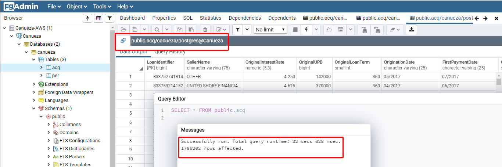
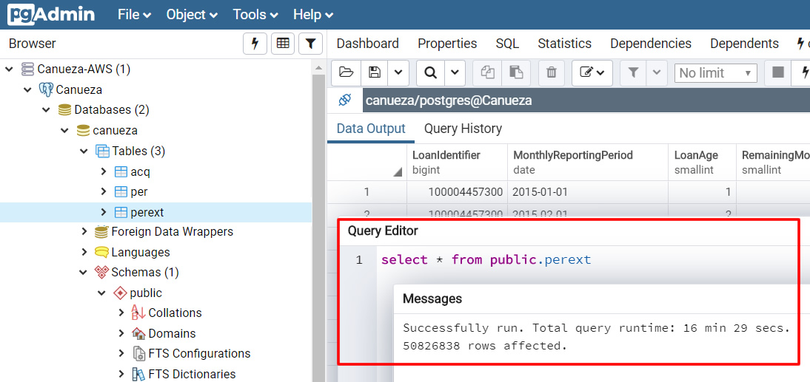
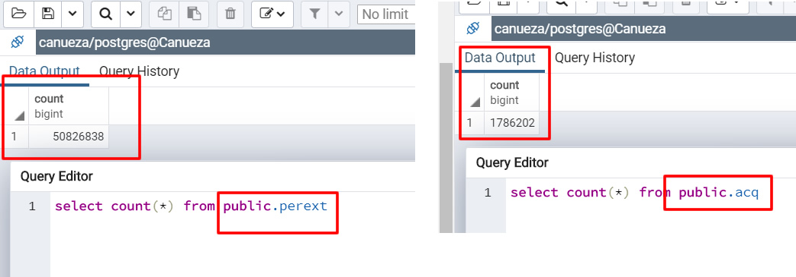

# Mortgage Modeling:
## Capstone Machine Learning Data Analytics Project


## Team members: Lisa Cannon, Oswald Vinueza, Brian Labelle.

## Link: http://www.canueza.com/


# Data:
Fannie Mae Single-Family Acquisition and Performance data.
Files are released quarterly but contain monthly information. Each of the quarterly files (Acquisition and Performance) contains information on loans that originated in that quarter and all history to the most recent quarter.
Fannie Mae is the nickname of FNMA, the Federal National Mortgage Association. Fannie Mae was established in 1938 by congress as part of the New Deal to stimulate the housing market by making mortgage more attainable for low- and middle-income families. Fannie Mae does not originate loans, but it does back or guarantee them.

# Goal:
The goal of this project is to use Fannie Mae’s mortgage performance data to make predictions about a given customer. We want to forecast 1. the probability a borrower will go into default in the next quarter, 2. the probability a borrower will not pay their next mortgage payment, 3. how long until a borrower goes into default, and 4. how these trends vary geographically.

	Proposed Methods:
	
	1. The probability a borrower will go into default in the next quarter.
		a. Logistic regression on default indicator
		b. Other ML techniques
		c. Automate selecting best model—display optimal model, graphics relevant to chosen model
		d. Chose state to build state level model
	
	2. The probability a borrower will not pay their next mortgage payment.
		a. Logistic regression on missed payment indicator
		b. Other ML techniques
		c. Automate selecting best model—display optimal model, graphics relevant to chosen model
		d. State level
	
	3. How long until a borrower goes into default.
		a. Hazard model
		b. State level
	
	4. Forecast Visualization: Enter your info and get probability of default and time to default.
	
	5. Map Visualization: How these trends vary geographically.
	
	
# Inspiration:
Lorem ipsum dolor sit amet, consectetur adipiscing elit, sed do eiusmod tempor incididunt ut labore et dolore magna aliqua. Ut enim ad minim veniam, quis nostrud exercitation ullamco laboris nisi ut aliquip ex ea commodo consequat. Duis aute irure dolor in reprehenderit in voluptate velit esse cillum dolore eu fugiat nulla pariatur. Excepteur sint occaecat cupidatat non proident, sunt in culpa qui officia deserunt mollit anim id est laborum.

 
# Conclusion:
```
Lorem ipsum dolor sit amet, consectetur adipiscing elit, sed do eiusmod tempor incididunt ut labore et dolore magna aliqua. Ut enim ad minim veniam, quis nostrud exercitation ullamco laboris nisi ut aliquip ex ea commodo consequat. Duis aute irure dolor in reprehenderit in voluptate velit esse cillum dolore eu fugiat nulla pariatur. Excepteur sint occaecat cupidatat non proident, sunt in culpa qui officia deserunt mollit anim id est laborum.
```

# What’s next for analysis?:   
```
Lorem ipsum dolor sit amet, consectetur adipiscing elit, sed do eiusmod tempor incididunt ut labore et dolore magna aliqua. Ut enim ad minim veniam, quis nostrud exercitation ullamco laboris nisi ut aliquip ex ea commodo consequat. Duis aute irure dolor in reprehenderit in voluptate velit esse cillum dolore eu fugiat nulla pariatur. Excepteur sint occaecat cupidatat non proident, sunt in culpa qui officia deserunt mollit anim id est laborum.

```

-----------------------------------------------

# Data Management / Cleaning / Flask Coding

1. The Fannie Mae Single-Family Loan Performance Data was downloaded as CSV files from Fannie Mae website.

2. In the master dataset, we ensured referential integrity and brought the data to 3rd normal form. Referential integrity states that table relationships must always be consistent. In other words, any foreign key field must agree with the primary key that is referenced by the foreign key. Third normal form (3NF) is a normal form that is used in normalizing a database design to reduce the duplication of data and ensure referential integrity.

3. The data was cleaned using Python Pandas. ( Oswald to provide additional filtering steps taken ).

4. AWS RDS ( Amazon Web Services ) was chosen as our cost effective data warehouse based on the amount of data that we would need to run through our machine learning models. The free tier Amazon Linux AMI 2018.03.0 (HVM) was selected based on the default image which includes AWS command line tools, Python, Ruby, Perl, and Java. The repositories include Docker, PHP, MySQL, PostgreSQL, and other packages.


5. Postgres PGAdmin was used to create the SQL tables, ACQ, PER ( Sample Data ), PEREXT ( full data )
6. Postgres PGAdmin was used to import the TXT files into the created SQL tables. This was done during the proof of concept phase. It would be easily configured to populate Postgres on AWS RDS directly from Pandas.








# Python Flask coding: 
Created the framework of the app.py, template/index.html, static/js/app.js files to connect to the ProgresSQL database and create a hello world template to build on.  


# Leaflet Loans Originated Map
	1. Leaflet 1.3.3, a JS library
	2. GeoJSON file was created based off of the Fannie Mae Dataset.
	3. MapBox map layer is populated by 54 features. Each feature having 8 properties 
	   and geometry multi-polygon coordinates.
	
	


# Time Series Visualization:  
Lorem ipsum dolor sit amet, consectetur adipiscing elit, sed do eiusmod tempor incididunt ut labore et dolore magna aliqua. Ut enim ad minim veniam, quis nostrud exercitation ullamco laboris nisi ut aliquip ex ea commodo consequat. Duis aute irure dolor in reprehenderit in voluptate velit esse cillum dolore eu fugiat nulla pariatur. Excepteur sint occaecat cupidatat non proident, sunt in culpa qui officia deserunt mollit anim id est laborum.

# Analysis:  
Lorem ipsum dolor sit amet, consectetur adipiscing elit, sed do eiusmod tempor incididunt ut labore et dolore magna aliqua. Ut enim ad minim veniam, quis nostrud exercitation ullamco laboris nisi ut aliquip ex ea commodo consequat. Duis aute irure dolor in reprehenderit in voluptate velit esse cillum dolore eu fugiat nulla pariatur. Excepteur sint occaecat cupidatat non proident, sunt in culpa qui officia deserunt mollit anim id est laborum.


-----------------------------------------------

# Canueza Marketing | www.canueza.com 

	1. Domain name registration, project branded email addresses, hosted website.
	2. Search Engine Optimized website, Google Analytics, Google Submitted sitemap.xml & robots.txt. 
	3. Social Media accounts, Twitter, Linkedin Business Page, Youtube Channel & Facebook page.

1. As with any brand, you may have the best product or service but if no ones knows about you or can find you, there's no point. After uniquely naming our project, we immedately purchased the domain and secured a website hosting service on hostway.com.


2. Email addresses were quickly created afterwards to facilitate communications between the team and create a source for any outside potential customers / employers to contact us via a professional corporate email address. First impression perception is everything.


3. We implemented Google Analytics across all html pages inorder to track multiple dimensions. Oswald Vinueza's name ready shows up 5th out of 60k SERPS ( Search Engine Results Pages ) 


3. Social Media accounts were created including Twitter, Linkedin Corporate Pages, Facebook Pages. Even for this small project, SEO ( Search Engine Optimization) still helps us rank. If anyone 


4. The entire site was also search engine optimized.


-----------------------------------------------

# TECHNOLOGY UTILIZED:


### Prerequisites

```
python-3.6.2
Flask-PyMongo 2.3.0
Flask-SQLAlchemy 2.4.0
gunicorn 19.9.0
Jinja2 2.10.1
psycopg2 2.8.3
SQLAlchemy 1.2.19
gunicorn 19.9.0
```

### Collaborative Coding Environment

Python code was developed mainly utilizing Microsoft Visual Studio with Python Flask. 
4 app.py were created to manage 9 different visualizations. ( map visualizations were not completed.) 


	* Canuezatrend.herokuapp.com | World Immunization Trend Chart
			- Vaccination Coverage 
			- Life Expectancy / Infant Mortality 

	* Canuezalife.herokuapp.com | Life Expectancy Regression
			- Life Expectancy Linear Regression Fit
			- Life Expectancy Normal Q-Q Plot
			- Life Expectancy Residual Plot
			
	* Canuezainfant.herokuapp.com | Infant Mortality Regression
			- Infant Mortality Linear Regression Fit
			- Infant Mortality Normal Q-Q Plot
			- Infant Mortality Residual Plot
			
	* Canueza2.herokuapp.com | World Immunization Progress Chart
			- main app.py to launch the main UI Web App

	* Canueza.herokuapp.com | World Immunization Progress Chart
			- original heroku web app that still 
				- houses 70k rows of PostGres Unicef Data
				- lat long data by country for potential map visualizations
				


## Deployment

Lorem ipsum dolor sit amet, consectetur adipiscing elit, sed do eiusmod tempor incididunt ut labore et dolore magna aliqua. Ut enim ad minim veniam, quis nostrud exercitation ullamco laboris nisi ut aliquip ex ea commodo consequat. Duis aute irure dolor in reprehenderit in voluptate velit esse cillum dolore eu fugiat nulla pariatur. Excepteur sint occaecat cupidatat non proident, sunt in culpa qui officia deserunt mollit anim id est laborum.


## Tools that were used to built this project:
```
* Visual Studio Code v1.39.2 - code development
* Adobe DreamWeaver v19.2.1 - Management & development of HTML files.
* Postgres pgAdmin v4.9 - SQL Table creation on Heroku
* Adobe Fireworks CS6 - Graphic editing

* Adobe Premiere Rush v1.2.8 - Video editing
* WinMerge v2.16.4 - easy side by side code comparison
* GitHub Desktop v2.2.1 - sharing code
* Tableau Tableau 2019.3
* Tableau Prep Builder 2019.3

* Heroku - Platform as a Service - hobby basic plan for 10,000,000 rows of data.
* Heroku - PostGres Add-on v11 Data Store

* Ashton Responsive HTML Template from Theme Forest ( Envato.com )
* several video files from Envato.com
```

### Not Included in this project but were planned.
	* [HighCharts.com](https://www.highcharts.com/maps/demo/all-maps)
	* Heroku Dataclips : SQL
	* Heroku Dataclips : JSON
	

#  Future Development


Lorem ipsum dolor sit amet, consectetur adipiscing elit, sed do eiusmod tempor incididunt ut labore et dolore magna aliqua. Ut enim ad minim veniam, quis nostrud exercitation ullamco laboris nisi ut aliquip ex ea commodo consequat. Duis aute irure dolor in reprehenderit in voluptate velit esse cillum dolore eu fugiat nulla pariatur. Excepteur sint occaecat cupidatat non proident, sunt in culpa qui officia deserunt mollit anim id est laborum. 


Lorem ipsum dolor sit amet, consectetur adipiscing elit, sed do eiusmod tempor incididunt ut labore et dolore magna aliqua. Ut enim ad minim veniam, quis nostrud exercitation ullamco laboris nisi ut aliquip ex ea commodo consequat. Duis aute irure dolor in reprehenderit in voluptate velit esse cillum dolore eu fugiat nulla pariatur. Excepteur sint occaecat cupidatat non proident, sunt in culpa qui officia deserunt mollit anim id est laborum.

Lorem ipsum dolor sit amet, consectetur adipiscing elit, sed do eiusmod tempor incididunt ut labore et dolore magna aliqua. Ut enim ad minim veniam, quis nostrud exercitation ullamco laboris nisi ut aliquip ex ea commodo consequat. Duis aute irure dolor in reprehenderit in voluptate velit esse cillum dolore eu fugiat nulla pariatur. Excepteur sint occaecat cupidatat non proident, sunt in culpa qui officia deserunt mollit anim id est laborum.

## Link

 http://www.canueza.com/


