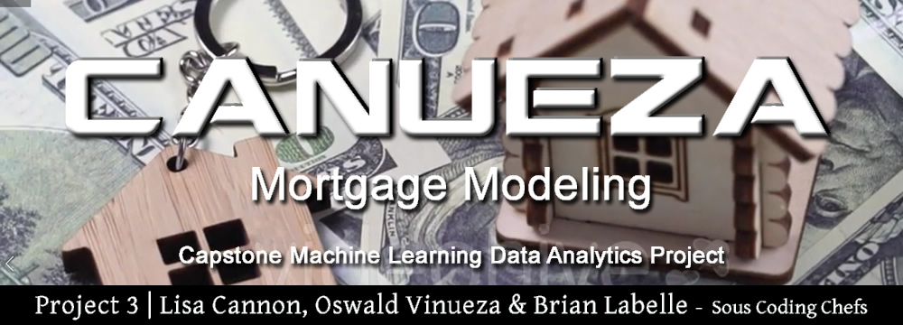
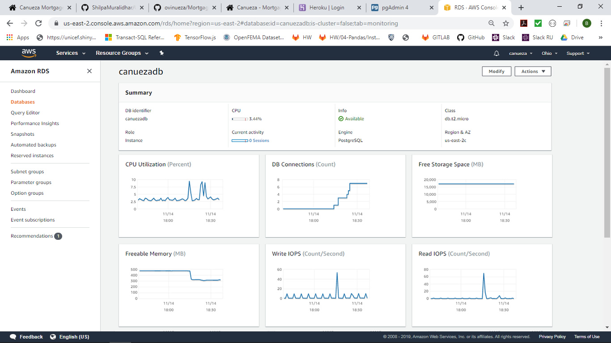
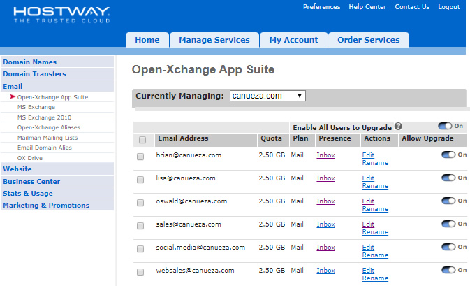
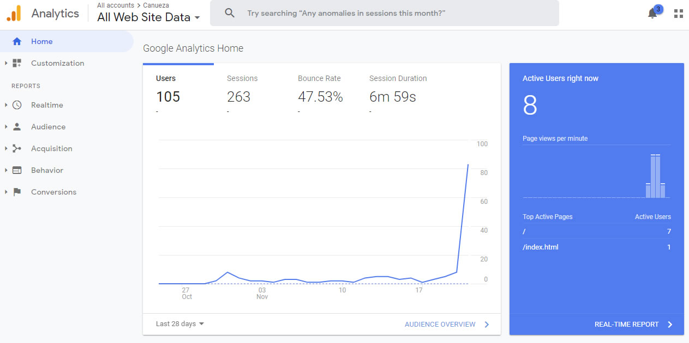
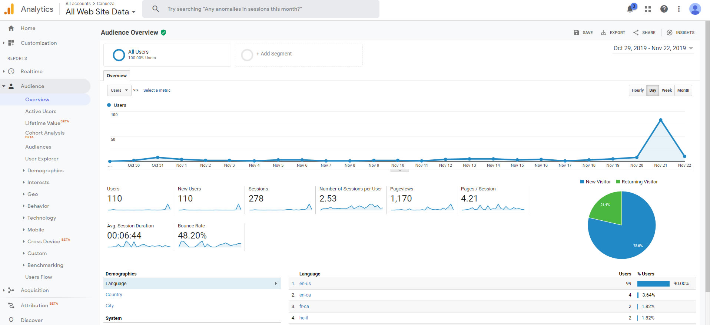
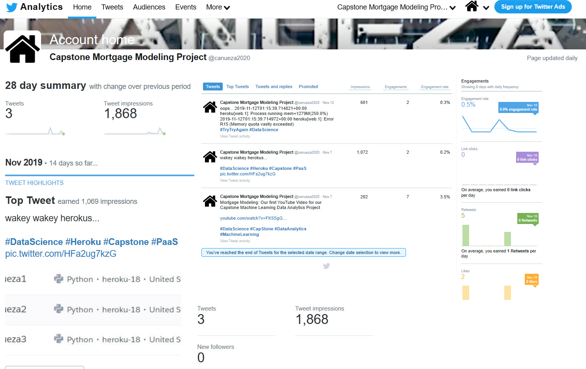
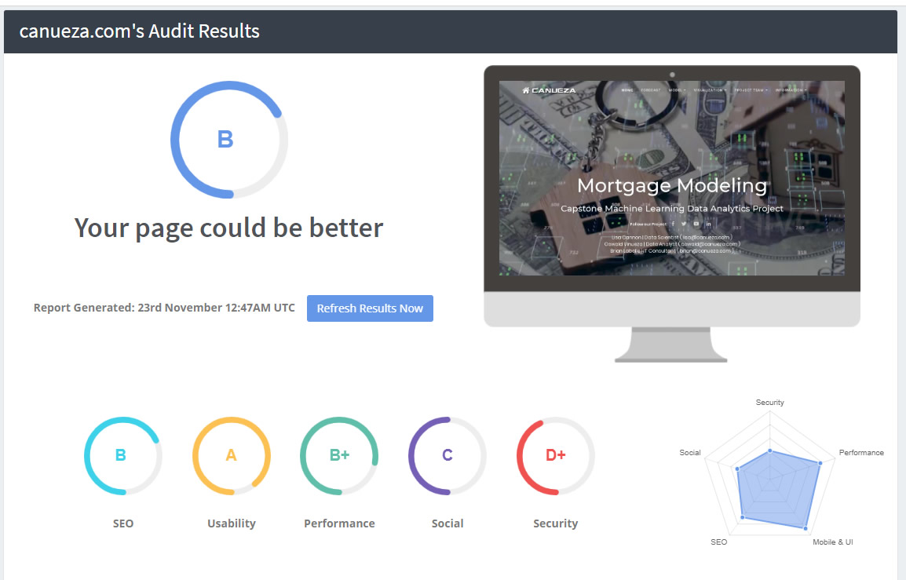

# Mortgage Modeling:
## Capstone Machine Learning Data Analytics Project




## Team members: Lisa Cannon, Oswald Vinueza, Brian Labelle.

## Link: http://www.canueza.com/


# Data:
Fannie Mae Single-Family Acquisition and Performance data.
Files are released quarterly but contain monthly information. Each of the quarterly files (Acquisition and Performance) contains information on loans that originated in that quarter and all history to the most recent quarter.
Fannie Mae is the nickname of FNMA, the Federal National Mortgage Association. Fannie Mae was established in 1938 by congress as part of the New Deal to stimulate the housing market by making mortgage more attainable for low- and middle-income families. Fannie Mae does not originate loans, but it does back or guarantee them.

# Goal:
The goal of this project is to use Fannie Mae’s mortgage performance data to make predictions about a given customer. We want to forecast 1. the probability a borrower will go into default in the next quarter, 2. the probability a borrower will not pay their next mortgage payment, 3. how long until a borrower goes into default, and 4. how these trends vary geographically.

	Proposed Methods:
	
	1. The probability a borrower will go into default in the next quarter.
		a. Logistic regression on default indicator
		b. Other ML techniques
		c. Automate selecting best model—display optimal model, graphics relevant to chosen model
		d. Chose state to build state level model
	
	2. The probability a borrower will not pay their next mortgage payment.
		a. Logistic regression on missed payment indicator
		b. Other ML techniques
		c. Automate selecting best model—display optimal model, graphics relevant to chosen model
		d. State level
	
	3. How long until a borrower goes into default.
		a. Hazard model
		b. State level
	
	4. Forecast Visualization: Enter your info and get probability of default and time to default.
	
	5. Map Visualization: How these trends vary geographically.
	
	
# Inspiration:
The Federal National Mortgage Association (Fannie Mae) guarantees mortgages to stimulate lenders to assume the risk of extending a mortgage to a qualified borrower.  In order to qualify for a mortgage backed by Fannie Mae, borrowers must meet certain criteria that are strong indicators of their ability to pay the loan.  Despite choosing borrowers that meet criteria, sometimes, borrowers are not able to make regular payments on their loan and might even go into default. Lenders know there will be some loss involved in mortgage lending.  If the lender can predict how much loss they might incur, they can employ methods to hedge their losses.  

In this project we seek to provide a tool that will help a lender to determine if an individual account will default given certain origination information and current age.   

 
 # Analysis:  
The focus of this analysis is to develop a loan level model that predicts whether a borrower will default (miss 4 or more payments) on their mortgage based on origination nand performance information available through Fannie Mae.  

Model fitting began with logistic regression on a random sample of Fannie Mae data.  The resulting model had an accuracy score off 99.8%, which seems too good to be true.  When you look at the precision of both outcomes: default or not default.  There was not a single prediction of defaulting.  Thus, not defaulting was predicted with 100% accuracy, and defaulting was predicted with 0% accuracy.  This averaged out to a score of 99.8 because the number of defaults present in the data is very small.

In order to make predictions about defaulting, more observations of default are needed.  Because the model assumes independence among the observations and is not trying to make predictions about the population, but instead a single account, the proportion of loans that defaulted are sampled at a higher rate than loans that do not default.  

Running logistic regression using LogisticRegressionCV with the oversampled data provided better results.  While the accuracy number was still high, 91%, the precision of default was improved, though not ideal at 61%. 

A decision tree was fitted to the oversampled data set.  In order to see any significant splits that identified delinquency, the depth had to be set at at least 5.  At this depth, the tree is very complex, with 32 nodes, with only 5 of those nodes identifying default.

A random forest model was fitted using XGBoost provided a very accurate prediction of both defaulting and not defaulting (0 and 100%, respectively).

All fitted models seem to be most influenced by the age of a loan. As a loan ages, it's likelihood of defaulting increases.  This might be because once a borrower begins to miss payments, it becomes increasingly hard as time passes to right their account. As the borrower gets further away from the date they qualified for their loan, there is more opportunity for their credit score, or debt to income to change, thus providing more possibility for default as time passes.

 
# Conclusion:
Though several modeling techniques were investigated, the best models to provide a prediction of default were logistic regression and Random Forest using XGBoost.  Both models are used to provide a user with a prediction of default given information enter for an individual loan.


# What’s next for analysis?:   


This initial analysis of the Fannie Mae data uses two modeling techniques to answer one question, whether a borrower will default.  There are more opportunities for analysis and prediction using this data.  There are also other methods and modifications to the existing analysis that might improve the prediction of default. 

_Further Default Prediction Analysis_
There are more modeling techniques that might provide better prediction of a borrower defaulting.    A Bayesian forecast technique could be implemented assuming a distribution on the current loan delinquency status from the previous month to predict whether a borrower will default. 
A RandomizedSearchCV method of random forest optimization is thought to yield more robust solutions than the XGBoost method that was used here.  It would be of interest to compare the accuracy of different random forest modeling methods.

_Data Enhancements_
This study focuses on a narrow timeline to draw conclusions about defaulting early in the life of a mortgage.  Defaulting is possible at any stage of a loan’s lifetime.  Including data over a broader timeline would create a more robust model could predict default in more mature mortgages.  
To better capture the regional differences in the economic wellbeing in the country, including an MSA level Case Shiller Index would provide another variable that likely has a high correlation with defaulting trends.

_Additional Questions the Data Can Answer_
While this study focuses on defaulting (missing 4 or more payments), an early look at delinquency could also be useful.  The likelihood of missing a payment given the current loan delinquency status could be modeled using a Bayesian Logistic Regression, where the current delinquency status has an assumed distribution.
Another outcome of interest is whether a loan will be prepaid.  It would be interesting to look at factors that are predictive of whether a borrower will prepay their loan.
Another way to look at the data is to consider how long it takes for a customer to default or miss a payment.  Estimating the time until default could be accomplished using a hazard survival model where defaulting is the event of interest and loans that do not default in the observed time period are considered censored. Considering 3 possible ways for a mortgage to end, payment until maturity, default, and prepay, a competing risk hazard model could predict the time until any event that might result in the loan not reaching maturity. 


-----------------------------------------------

# Data Management / Cleaning / Flask Coding

1. The Fannie Mae Single-Family Loan Performance Data was downloaded as CSV files from Fannie Mae website.

2. In the master dataset, we ensured referential integrity and brought the data to 3rd normal form. Referential integrity states that table relationships must always be consistent. In other words, any foreign key field must agree with the primary key that is referenced by the foreign key. Third normal form (3NF) is a normal form that is used in normalizing a database design to reduce the duplication of data and ensure referential integrity.

3. The data was cleaned using Python Pandas. We started by concatenating all years into a single Acquisition file and then filtering by Single Family, Principal Residence and Purchase Only, which helped us narrow the scope of this project. 
Afterwards, we selected the loans from the Performance data, based on the loan identifier from the cleaned Acquisition table. Due to the size of the files it was necessary to break down the selection and cleaning process first by quarter and then concatenating the files by year.
Finally, to start the machine learning process we took an oversample due to the low percentage of loans with delinquency.


4. AWS RDS ( Amazon Web Services ) was chosen as our cost effective data warehouse based on the amount of data that we would need to run through our machine learning models. The free tier Amazon Linux AMI 2018.03.0 (HVM) was selected based on the default image which includes AWS command line tools, Python, Ruby, Perl, and Java. The repositories include Docker, PHP, MySQL, PostgreSQL, and other packages.



5. Postgres PGAdmin was used to create the SQL tables, ACQ, PER ( Sample Data ), PEREXT ( full data )
6. Postgres PGAdmin was used to import the TXT files into the created SQL tables. This was done during the proof of concept phase. It would be easily configured to populate Postgres on AWS RDS directly from Pandas.


# Python Flask coding: 
Created the framework of the app.py, template/index.html, static/js/app.js files to connect to the ProgresSQL database and create a hello world template to build on.  


# Leaflet Loans Originated Map
	1. Leaflet 1.3.3, a JS library
	2. GeoJSON file was created based off of the Fannie Mae Dataset.
	3. Geometry obtained from https://www1.ncdc.noaa.gov/pub/data/nidis/geojson/us/base/unitedstates.geojson
	4. MapBox map layer is populated by 54 features. Each feature having 8 properties 
	   and geometry multi-polygon coordinates.

# Tableau: 
Tableau presentation plus addition graphs created from source data can be found [here](https://public.tableau.com/profile/oswald.vinueza#!/vizhome/Project3_15738645799510/FannieMaeDataOverview)

-----------------------------------------------

# Canueza Marketing | www.canueza.com 

	1. Domain name registration, project branded email addresses, hosted website.
	2. Search Engine Optimized website, Google Analytics, Google Submitted sitemap.xml & robots.txt. 
	3. Social Media accounts, Twitter, Linkedin Business Page, Youtube Channel & Facebook page.

1. As with any brand, you may have the best product or service but if no ones knows about you or can find you, there's no point. After uniquely naming our project, we immedately purchased the domain and secured a website hosting service on hostway.com.



2. Email addresses were quickly created afterwards to facilitate communications between the team and create a source for any outside potential customers / employers to contact us via a professional corporate email address. First impression perception is everything.



3. We implemented Google Analytics across all html pages inorder to track multiple dimensions. Oswald Vinueza's name ready shows up 5th out of 60k SERPS ( Search Engine Results Pages ) 



3. Social Media accounts were created including Twitter, Linkedin Corporate Pages, Facebook Pages. Even for this small project, SEO ( Search Engine Optimization) still helps us rank. If anyone 





4. The entire site was also search engine optimized.



-----------------------------------------------

# TECHNOLOGY UTILIZED:

### Prerequisites

```
python-3.6.2
Flask-PyMongo 2.3.0
Flask-SQLAlchemy 2.4.0
gunicorn 19.9.0
Jinja2 2.10.1
psycopg2 2.8.3
SQLAlchemy 1.2.19
gunicorn 19.9.0
```

### Collaborative Coding Environment

Python code was developed mainly utilizing Microsoft Visual Studio with Python Flask. 
4 app.py were created to manage 9 different visualizations. ( map visualizations were not completed.) 


	* canuezaxxxxx.herokuapp.com | Mortgage Modeling
			- Lorem ipsum dolor sit amet, consectetur adipiscing elit, sed do eiusmod tempor incididunt ut labore et dolore magna aliqua. 
			- Lorem ipsum dolor sit amet, consectetur adipiscing elit, sed do eiusmod tempor incididunt ut labore et dolore magna aliqua.

	* canuezaxxxxx.herokuapp.com | Mortgage Modeling
			- Lorem ipsum dolor sit amet, consectetur adipiscing elit, sed do eiusmod tempor incididunt ut labore et dolore magna aliqua.
			- Lorem ipsum dolor sit amet, consectetur adipiscing elit, sed do eiusmod tempor incididunt ut labore et dolore magna aliqua.
			- Lorem ipsum dolor sit amet, consectetur adipiscing elit, sed do eiusmod tempor incididunt ut labore et dolore magna aliqua.
			
	* canuezaxxxx.herokuapp.com | Mortgage Modeling
			- Lorem ipsum dolor sit amet, consectetur adipiscing elit, sed do eiusmod tempor incididunt ut labore et dolore magna aliqua.
			- Lorem ipsum dolor sit amet, consectetur adipiscing elit, sed do eiusmod tempor incididunt ut labore et dolore magna aliqua.
			- Lorem ipsum dolor sit amet, consectetur adipiscing elit, sed do eiusmod tempor incididunt ut labore et dolore magna aliqua.
			
				


## Deployment

Lorem ipsum dolor sit amet, consectetur adipiscing elit, sed do eiusmod tempor incididunt ut labore et dolore magna aliqua. Ut enim ad minim veniam, quis nostrud exercitation ullamco laboris nisi ut aliquip ex ea commodo consequat. Duis aute irure dolor in reprehenderit in voluptate velit esse cillum dolore eu fugiat nulla pariatur. Excepteur sint occaecat cupidatat non proident, sunt in culpa qui officia deserunt mollit anim id est laborum.


## Tools that were used to built this project:
```
* Visual Studio Code v1.39.2 - code development
* Adobe DreamWeaver v19.2.1 - Management & development of HTML files.
* Postgres pgAdmin v4.9 - SQL Table creation on Heroku
* Adobe Fireworks CS6 - Graphic editing

* Adobe Premiere Rush v1.2.8 - Video editing
* WinMerge v2.16.4 - easy side by side code comparison
* GitHub Desktop v2.2.1 - sharing code
* Tableau Tableau 2019.3
* Tableau Prep Builder 2019.3

* Heroku - Platform as a Service - hobby basic plan for 10,000,000 rows of data.
* Heroku - PostGres Add-on v11 Data Store

* Ashton Responsive HTML Template from Theme Forest ( Envato.com )
* several video files from Envato.com
```


	


## Link

 http://www.canueza.com/


